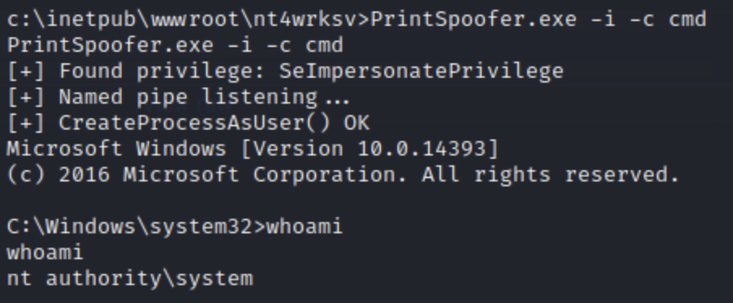

# Relevant

A write-up on a challenge from tryhackme.com

The IP addresses change a number of times. I had to reboot the systems.

This CTF is full of rabbit holes, honeypots, and deceptions! It took me a long time to figure out what was a dead end and what could actually get me access. I will be covering some of the rabbit holes that I got trapped by, but I don't think that I found all of them.


I began this challenge by assessing what services ran on the target.

### nmap 

```
┌──(root㉿kali)-[~]
└─# nmap -p- -sV -sC 10.10.39.24
Starting Nmap 7.93 ( https://nmap.org ) at 2023-08-14 23:45 UTC

Nmap scan report for ip-10-10-39-24.eu-west-1.compute.internal (10.10.39.24)
Host is up (0.0054s latency).
Not shown: 65526 filtered tcp ports (no-response)
PORT      STATE SERVICE       VERSION
80/tcp    open  http          Microsoft IIS httpd 10.0
|_http-server-header: Microsoft-IIS/10.0
|_http-title: IIS Windows Server
| http-methods: 
|_  Potentially risky methods: TRACE
135/tcp   open  msrpc         Microsoft Windows RPC
139/tcp   open  netbios-ssn   Microsoft Windows netbios-ssn
445/tcp   open  microsoft-ds  Windows Server 2016 Standard Evaluation 14393 microsoft-ds
3389/tcp  open  ms-wbt-server Microsoft Terminal Services
| ssl-cert: Subject: commonName=Relevant
| Not valid before: 2023-08-13T23:42:46
|_Not valid after:  2024-02-12T23:42:46
|_ssl-date: 2023-08-14T23:48:47+00:00; 0s from scanner time.
| rdp-ntlm-info: 
|   Target_Name: RELEVANT
|   NetBIOS_Domain_Name: RELEVANT
|   NetBIOS_Computer_Name: RELEVANT
|   DNS_Domain_Name: Relevant
|   DNS_Computer_Name: Relevant
|   Product_Version: 10.0.14393
|_  System_Time: 2023-08-14T23:48:07+00:00
5985/tcp  open  http          Microsoft HTTPAPI httpd 2.0 (SSDP/UPnP)
|_http-server-header: Microsoft-HTTPAPI/2.0
|_http-title: Not Found
49663/tcp open  http          Microsoft IIS httpd 10.0
| http-methods: 
|_  Potentially risky methods: TRACE
|_http-server-header: Microsoft-IIS/10.0
|_http-title: IIS Windows Server
49667/tcp open  msrpc         Microsoft Windows RPC
49669/tcp open  msrpc         Microsoft Windows RPC
MAC Address: 02:87:B5:0B:CD:D9 (Unknown)
Service Info: OSs: Windows, Windows Server 2008 R2 - 2012; CPE: cpe:/o:microsoft:windows

Host script results:
|_nbstat: NetBIOS name: RELEVANT, NetBIOS user: <unknown>, NetBIOS MAC: 0287b50bcdd9 (unknown)
| smb-os-discovery: 
|   OS: Windows Server 2016 Standard Evaluation 14393 (Windows Server 2016 Standard Evaluation 6.3)
|   Computer name: Relevant
|   NetBIOS computer name: RELEVANT\x00
|   Workgroup: WORKGROUP\x00
|_  System time: 2023-08-14T16:48:07-07:00
|_clock-skew: mean: 1h23m59s, deviation: 3h07m49s, median: 0s
| smb2-security-mode: 
|   311: 
|_    Message signing enabled but not required
| smb2-time: 
|   date: 2023-08-14T23:48:07
|_  start_date: 2023-08-14T23:43:02
| smb-security-mode: 
|   account_used: guest
|   authentication_level: user
|   challenge_response: supported
|_  message_signing: disabled (dangerous, but default)                       
```

### eternal blue - too good to be true

I was interested by the service running on port 445, and so I looked it up.


It appeared to be vulnerable based on a scan on msfconsole.


It does not properly execute. Of course this is too good to be true! I investigated further to see if I had made any errors, but after editing the settings with no success, I decided to try a different attack.


### website on port 80

I investigated the website and found a standard IIS welcome page.


I attempted a directory bust but got nothing useful.

### smb

Port 445 was not vulnerable to eternal blue, but SMB can be a good service to gain information.


The guest has a blank password.


In the nt4wrksv share, I found a password file.


The credentials are 
```
Bob - !P@$$W0rD!123

Bill - Juw4nnaM4n420696969!$$$
```


It looked like Bob was a user, but Bill seemed to not exist. evil-winrm didn't reveal anything when I attempted to use it.

This ended up not going anywhere. A rabbit hole!


### gobuster
Looking back at the nmap scan, I investigated the website that was hosted on port 49663. It was a default IIS welcome page.


I ran gobuster on this webpage and found something worthwhile.

```
┌──(root㉿kali)-[~]
└─# gobuster dir -u http://10.10.39.24:49663 -w /usr/share/wordlists/seclists/Discovery/Web-Content/directory-list-2.3-medium.txt
```


There is a directory which shares the same name as the SMB share.


It is blank, but I can access files in the SMB share.


This seemed like a way to get access to the system by uploading a shell.


### upload a shell

This is the [shell](https://github.com/borjmz/aspx-reverse-shell/blob/master/shell.aspx). Note that it is ASPX, commonly used on Microsoft websites.


Activate a listener.


I established a shell on the system. Then I looked for first flag.


**THM{fdk4ka34vk346ksxfr21tg789ktf45}**


## escalation


The SeImpersonatePrivilege is enabled and vulnerable to a program called [printspoofer](https://github.com/dievus/printspoofer).

Uploading the executable is trivially easy since we can upload anything to the SMB share.


The exploit is extremely simple to run.



 

**THM{1fk5kf469devly1gl320zafgl345pv}**

Thus the room was completed.